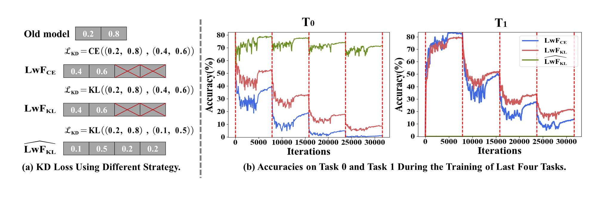
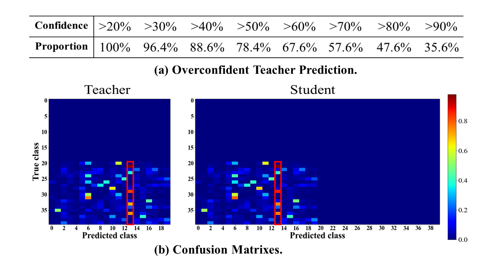
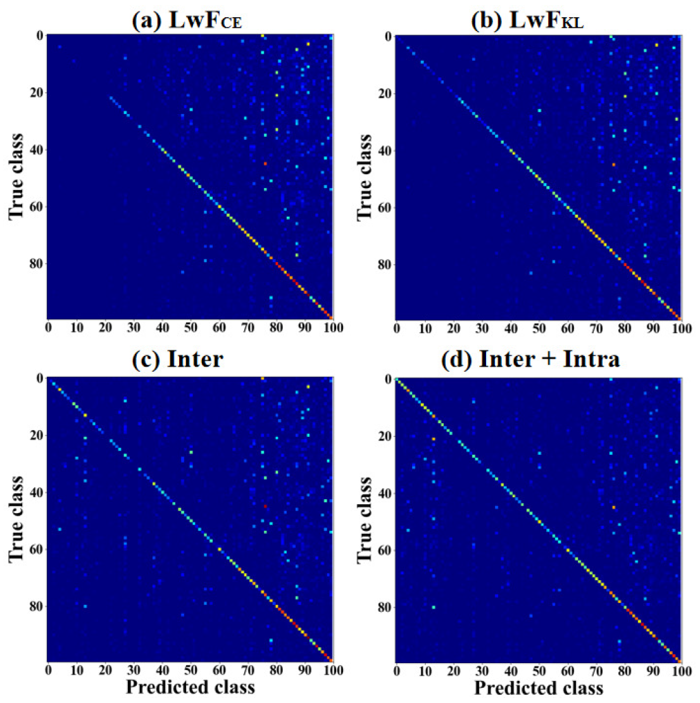
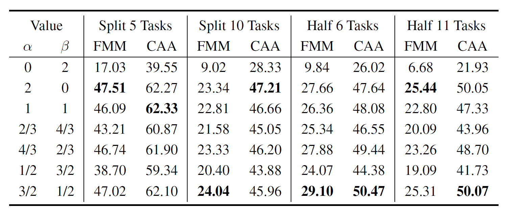

# Maintaining Fairness in Logit-based Knowledge Distillation for Class-Incremental Learning

<p align="center">

</p>

## Abstract

Logit-based knowledge distillation (KD) is commonly used to mitigate catastrophic forgetting in class-incremental learning (CIL) caused by data distribution shifts. However, the strict match of logit values between student and teacher models conflicts with the cross-entropy (CE) loss objective of learning new classes, leading to significant recency bias.
To address this issue, we rethink the overlooked limitations of KD-based methods through empirical analysis. Inspired by our findings, we introduce a plug-and-play pre-process method that normalizes the logits of both the student and teacher across all classes, rather than just the old classes, before distillation. This approach allows the student to focus on both old and new classes, capturing intrinsic inter-class relations from the teacher. By doing so, our method avoids the inherent conflict between KD and CE, maintaining fairness between old and new classes.
Additionally, recognizing that overconfident teacher predictions can hinder the transfer of inter-class relations (i.e., dark knowledge), we extend our method to capture intra-class relations among different instances, ensuring fairness within old classes. Our method integrates seamlessly with existing logit-based KD approaches, consistently enhancing their performance across multiple CIL benchmarks without incurring additional training costs.


## Our Empirical Findings 

### KD-based Overlooked Sub-optimality

<div style="text-align:center; display: flex; justify-content: center;">
<figure style="margin: 0;">
    
</div>

To explore the sub-optimality in KD-based CIL, we conducted comprehensive experiments on LwF using both CE-based and KL-based distillation, referred to as $LwF_{CE}$ and $LwF_{KL}$, respectively. These experiments were performed under the standard incremental setting—training from scratch—using the CIFAR-100 dataset. Specifically, we equally divided the classes into five tasks and continuously evaluated the model's accuracy on tasks $T_0$ and $T_1$ at each iteration.

as shown in Figure(a), we modified the student model's probability calculation procedure to incorporate logits for the new classes: 
$\begin{equation}
    q_i(x)=\frac{e^{z_{i} / \tau}}{\sum_{j=1}^{O+N} e^{z_{j} / \tau}}
\end{equation}$ .This led to the development of a novel distillation mechanism, referred to as $\widehat{LwF_{KL}}$. As shown in Figure (a), this mechanism significantly reduces temporary forgetting, allowing almost all old knowledge from $T_0$ to be recovered in $\widehat{LwF_{KL}}$.

In Figure(b), we present the accuracy curves for the model on the first two tasks  $T_0$ and $T_{1}$across the training of the subsequent four tasks of a total of five tasks. For clarity, we have omitted the accuracy curve during the initial task $T_0$ training as the three baseline models exhibit identical performance. The vertical bars mark the transitions between tasks. It's obvious that both $LwF_{CE}$ and $LwF_{KL}$ exhibit significant $\textit{temporary forgetting}$ during task transitions, followed by $\textit{partial recovery}$. This phenomenon, known as the stability gap, highlights the transient forgetting of old knowledge when learning new tasks.

Notably, $LwF_{KL}$ outperforms $LwF_{CE}$ on task $T_0$ in both aspects. This advantage is due to KL loss's ability to measure the divergence between the softened probability distributions of the teacher and student models, ensuring the transfer of fine-grained information. In contrast, CE loss focuses solely on matching class probabilities, potentially overlooking the rich information in the relative probabilities of other classes. This limitation makes CE loss less effective at capturing nuanced differences between the teacher's and student's outputs, leading to more severe forgetting and hindering knowledge recovery.

### The Impact of Enforcing An Exact Match

<div style="text-align:center; display: flex; justify-content: center;">
<figure style="margin: 0;">
    
</div>
as shown in Figure (b), the accuracy on the new task $T_1$ in $\widehat{LwF_{KL}}$ remains at 0. To explore the root causes, Figure(d) compares the confusion matrices for task $T_1$ using the student model after learning with that of the teacher model, revealing that the student model exhibits extremely high consistency with the teacher's classifications. Meanwhile, Figure(c) shows the teacher model’s maximum classification probabilities of new samples and the proportion of samples exceeding various probability thresholds.

These observations suggest that the student's prediction probabilities for old classes mirror those of the teacher (i.e., $\forall i \in[1, O], \hat{q}_i(x) = {q}_i(x)$), resulting in a minimized $\mathcal{L}_{\mathrm{KD}}$. This implies that the student and teacher models share the same mean and variance of logits, reflecting that the current $\mathcal{L}_{\mathrm{KD}}$ enforces an exact match in both value range and variance~\cite{logitstd}. This strict alignment hampers the student's ability to learn new knowledge in $\widehat{LwF_{KL}}$ and limits the recovery of old knowledge in $LwF_{KL}$ and $LwF_{CE}$.

## Effects of Our Method

### Visualized Analysis on Recency Bias

<p align="center">

</p>

To visualize the recency bias of different KD mechanisms, we calculated the norms of the classifier weight vectors after learning the new task $T_1$ and plotted them in the above Figure . If the norms of the weight vectors for new classes are larger, the output logits for new classes may generally tend to be larger. As shown in Figures (a) and (b), the norms of the weight vectors for new classes are significantly larger than those for old classes, indicating severe recency bias.

After applying our inter-class loss, as shown in Figure(c), the recency bias is significantly reduced, with the average norm values of the old and new classes becoming much closer (indicated by the blue and red dotted lines). Furthermore, in Figure(d), when both our inter-class and intra-class losses are applied, the dispersion of blue and red points decreases noticeably, leading to nearly overlapping dotted lines. These results vividly demonstrate the validity of our empirical analysis and theoretical foundations, confirming that our method effectively maintains fairness not only between old and new classes but also within old classes.

### Visual Comparison

<p align="center">

</p>

To provide a visual comparison, we present the confusion matrices for $LwF_{CE}$, $LwF_{KL}$, $LwF_{KL}$ with $\mathcal{L}_{\mathrm{inter}}$, and $LwF_{KL}$ with $\mathcal{L}_{\mathrm{inter}} + \mathcal{L}_{\mathrm{intra}}$ in the split 5 tasks setting on CIFAR-100. As illustrated in the above Figure, both $LwF_{CE}$ and $LwF_{KL}$ exhibit a clear classification bias, favoring new classes.
When the inter-class loss $\mathcal{L}_{\mathrm{inter}}$ is applied, this bias is already noticeably reduced. With the addition of the intra-class loss $\mathcal{L}_{\mathrm{intra}}$, the confusion and bias are further minimized, demonstrating that our method effectively achieves the goal of maintaining fairness between old and new classes.

### Plug-and-Play Performance 

<p align="center">

    <figcaption>Cifar and ImageNet-Subset</figcaption>
</p>

<p align="center">

    <figcaption>Tiny-ImageNet-200</figcaption>
</p>

## Installation and Usage

### Prerequisites

This project builds upon the works and codes done in [PyCIL]([GitHub - G-U-N/PyCIL: PyCIL: A Python Toolbox for Class-Incremental Learning](https://github.com/G-U-N/PyCIL)) . To get started, set up a conda environment and install the requirements listed by our repo.

### Configurations

#### Data Config:

Ensure to set custom paths to datasets in the data configuration file located at `/utils/data.py`.Our code supports tests on multiple datasets, such as `Cifar10`, `Cifar100`,` Imagenet-Subset`, `Tiny-Imagenet200`, and `Librispeech100` (Audio).

#### Pre-trained Model Config:

We offer six pre-trained models, specifically the pre-trained weights for Cifar100 Task0 and those for ImageNet-Subset Task0 .The parameter `preload` in `main.py` can be set to determine whether to use the pre-trained weights or not. And the loading path of the weight file is set in the code of each model within the `models` folder. 

#### Parameter Introduction:

`--config`:Path to the `exps/.json`file containing experiment settings.

`--device`: Specify computation devices, can be single or multiple GPU IDs.

`--increment`: Number of new classes to add in each incremental learning phase.

`--init_cls`: Number of classes to train in the first phase.

`--method`: Select which distillation method to use in the model.

`--dataset`: Specify the training dataset.

`--loadpre`: Binary flag to control whether to load a pre-trained model.

`--lambd`: Weight coefficient for balancing different parts of the loss function.

`--alpha`: Another loss function weight parameter for balancing different loss terms In `DER++`.

`--path`: Save path for model weight file In `DER`.

##### Notes:

1. All parameters have default values but can be overridden via command line arguments.

2. The `exps/.json` config file (--config) can also contain these parameters, which will be merged with command line argument.

#### Running the Code

```bash
# nohup python main.py --config './exps/lwf.json' --init_cls 20  --increment 20 --device "0" --method "normal" --dataset "cifar100" --loadpre 0 > normal_lwf_cifar_SplitT5.log 2>&1 &

# nohup python main.py --config './exps/lwf.json' --init_cls 20  --increment 20 --device "0" --method "KL" --dataset "cifar100" --loadpre 0 > KL_lwf_cifar_SplitT5.log 2>&1 &

# nohup python main.py --config './exps/lwf.json' --init_cls 20  --increment 20 --device "0" --method "interintra" --dataset "cifar100" --loadpre 0 > interintra_Lwf_lambda5_SplitT5.log 2>&1 &

```

See the `samples.sh` file for more command-line runtime code.

## Citation

If you found our work useful for your research, please cite our work:

