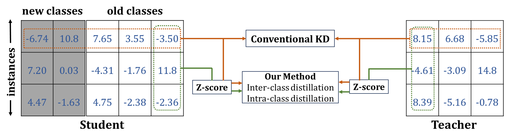
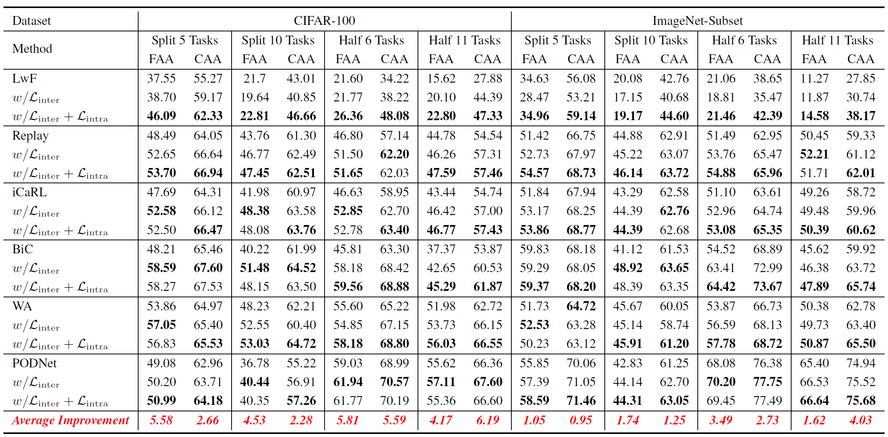
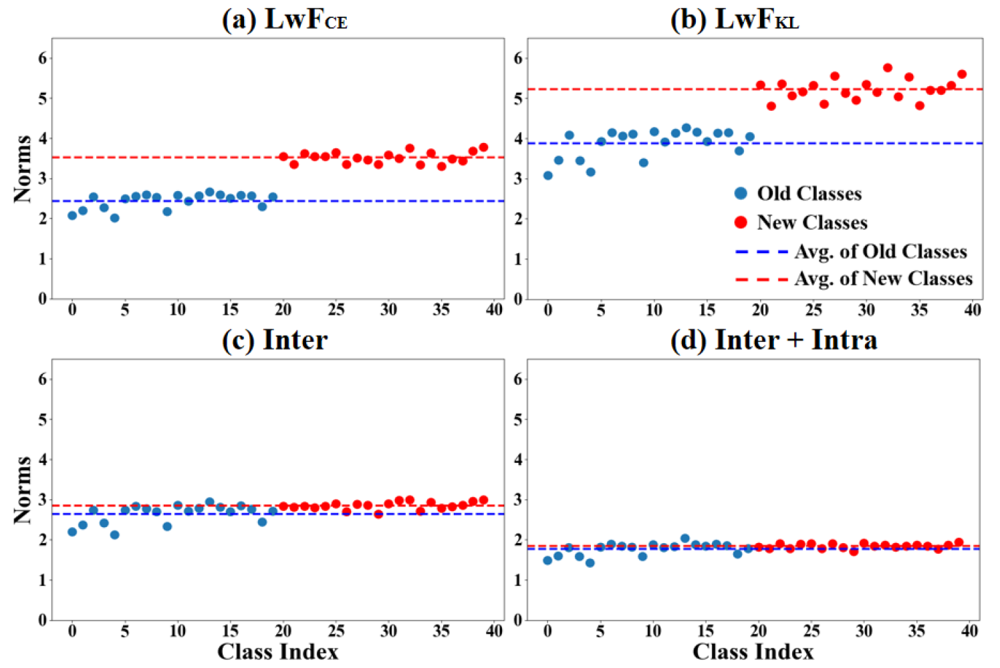

# Maintaining Fairness in Logit-based Knowledge Distillation for Class-Incremental Learning

<p align="center">

</p>

## Abstract

Logit-based knowledge distillation (KD) is commonly used to mitigate catastrophic forgetting in class-incremental learning (CIL) caused by data distribution shifts. However, the strict match of logit values between student and teacher models conflicts with the cross-entropy (CE) loss objective of learning new classes, leading to significant recency bias (i.e. unfairness).
To address this issue, we rethink the overlooked limitations of KD-based methods through empirical analysis. Inspired by our findings, we introduce a plug-and-play pre-process method that normalizes the logits of both the student and teacher across all classes, rather than just the old classes, before distillation. This approach allows the student to focus on both old and new classes, capturing intrinsic inter-class relations from the teacher. By doing so, our method avoids the inherent conflict between KD and CE, maintaining fairness between old and new classes.
Additionally, recognizing that overconfident teacher predictions can hinder the transfer of inter-class relations (i.e., dark knowledge), we extend our method to capture intra-class relations among different instances, ensuring fairness within old classes. Our method integrates seamlessly with existing logit-based KD approaches, consistently enhancing their performance across multiple CIL benchmarks without incurring additional training costs.

## Effects of Our Method

### Plug-and-Play Performance 

<p align="center">

</p>

### Visualized Analysis on Recency Bias

<p align="center">

</p>

To visualize the recency bias of different KD mechanisms, we calculated the norms of the classifier weight vectors after learning the first task and plotted them in the above Figure . If the norms of the weight vectors for new classes are larger, the output logits for new classes may generally tend to be larger. As shown in Figures (a) and (b), the norms of the weight vectors for new classes are significantly larger than those for old classes, indicating severe recency bias.
After applying our inter-class loss, as shown in Figure(c), the recency bias is significantly reduced, with the average norm values of the old and new classes becoming much closer (indicated by the blue and red dotted lines). Furthermore, in Figure(d), when both our inter-class and intra-class losses are applied, the dispersion of blue and red points decreases noticeably, leading to nearly overlapping dotted lines. These results vividly demonstrate the validity of our empirical analysis and theoretical foundations, confirming that our method effectively maintains fairness not only between old and new classes but also within old classes.

## Installation and Usage

### Prerequisites

This project builds upon the works and codes done in [PyCIL]([GitHub - G-U-N/PyCIL: PyCIL: A Python Toolbox for Class-Incremental Learning](https://github.com/G-U-N/PyCIL)) . To get started, set up a conda environment and install the requirements listed by our repo.

### Configurations

#### Data Config:

Ensure to set custom paths to datasets in the data configuration file located at `/utils/data.py`.Our code supports tests on multiple datasets, such as `Cifar10`, `Cifar100`,` Imagenet-Subset`, `Tiny-Imagenet200`, and `Librispeech100` (Audio).

#### Parameter Introduction:

`--config`:Path to the `exps/.json`file containing experiment settings.

`--device`: Specify computation devices, can be single or multiple GPU IDs.

`--increment`: Number of new classes to add in each incremental learning phase.

`--init_cls`: Number of classes to train in the first phase.

`--method`: Select which distillation method to use in the model.

`--dataset`: Specify the training dataset.

`--loadpre`: Binary flag to control whether to load a pre-trained model.

`--lambd`: Weight coefficient for balancing different parts of the loss function.

`--alpha`: Another loss function weight parameter for balancing different loss terms In `DER++`.

`--path`: Save path for model weight file In `DER`.

##### Notes:

1. All parameters have default values but can be overridden via command line arguments.

2. The `exps/.json` config file (--config) can also contain these parameters, which will be merged with command line argument.

#### Running the Code

```bash
# nohup python main.py --config './exps/lwf.json' --init_cls 20  --increment 20 --device "0" --method "normal" --dataset "cifar100" --loadpre 0 > normal_lwf_cifar_SplitT5.log 2>&1 &

# nohup python main.py --config './exps/lwf.json' --init_cls 20  --increment 20 --device "0" --method "KL" --dataset "cifar100" --loadpre 0 > KL_lwf_cifar_SplitT5.log 2>&1 &

# nohup python main.py --config './exps/lwf.json' --init_cls 20  --increment 20 --device "0" --method "interintra" --dataset "cifar100" --loadpre 0 > interintra_Lwf_lambda5_SplitT5.log 2>&1 &

```

See the `samples.sh` file for more command-line runtime code.

## Citation

If you found our work useful for your research, please cite our work:

    @article{FairnessGao25, 
    title={Maintaining Fairness in Logit-based Knowledge Distillation for Class-Incremental Learning}, 
    volume={}, 
    number={}, 
    journal={Proceedings of the AAAI Conference on Artificial Intelligence}, 
    author={Gao, Zijian and Han, Shanhao and Zhang, Xingxing and Xu, Kele and Zhou, Dulan and Mao, Xinjun and Dou, Yong and Wang, Huaimin}, 
    year={2025}, 
    month={}, 
    pages={}}
